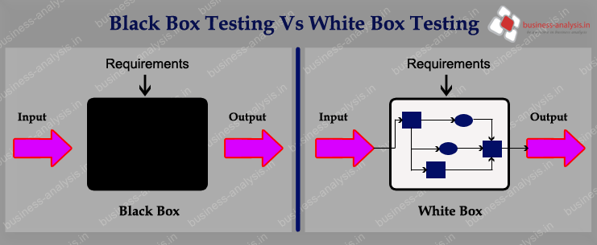

# 软件测试基础

这部分会介绍软件测试的基础

## 测试的目的和意义
我们为什么要花多很精力，金钱和时间做去测试？我感觉有没问题不就可以吗了？

真的吗？

你觉得没有问题是不一定靠谱的。

### 吓唬人的例子

* 2012年，美国KCP（Knight Capital Group）金融公司由于电子交易系统出现故障，交易算法出错，导致该公司对150支不同的股票高价购进、低价抛出，直接给公司带来了4.4亿美元的损失，当天股票下跌62%。
* 2005年，因计算机系统错误，密歇根政府将23名囚犯提前释放，而另外一些已到刑期的囚犯却仍然关在监狱里。 
* 2012年，苹果iOS 6首次尝试地图服务，由于许多地点和定位都出现错误，引来了无数人的抱怨。该错误导致1000万用户在48个小时内纷纷涌向Google地图。
* 2004年，商业服务巨头EDS为英国儿童抚养机构开发了一个复杂、大型的IT系统，该系统意外地给190万人多付了款，又少付款给70万人，还有35亿英镑的儿童抚养费没有收取，积压的代办事项达23.9万件，有3.6万件新的案子卡在系统上，以及500个被记录的错误。 
* IRS是美国国税局的简称，在2006年，因技术人员对程序进行重新设计，导致反电子诈骗系统不能正常运行。该错误直接带来的经济损失达2到3亿美元，并且还花费了2100万美元来修复该错误。
* 2007年，美国洛杉矶国际机场因计算机系统故障导致航班延误和停飞，该故障主要源于一枚芯片无故失灵。该故障大约在10个小时后才得以恢复，期间约17000辆飞机受到影响。

### 测试一定要做

## 软件测试的分类

这里以软件功能方面的测试为例

* 开发者角度
  * 单元测试
  * 集成测试
* 用户角度
  * 功能测试
  * 系统测试

### 造小车为例说明
大致知道软件测试要做什么，这些术语知道大致意思就可以了，等用到了再去深刻理解

假设我要造一个玩具小车，我从一个轮子开始造，这个轮子就是一个基本的**功能单元**，有自己的功能，和外部的接口（轮轴），我想要测试这个轮子能不能转。这个时候不需要有任何其他的小车部件配合，就能测试轮子。

> 我不关心这个轮子是钢的，还是木头的，还是有什么结构，我只关心能不能转，也就是说轮子如果换了一个完全不一样的，只要保证能绕着轮轴转就可以了（**只关心能否完成指定功能，不关心具体实现**）

这个步骤就是`单元测试`

如果单元制造好了之后，就想知道这些单元连起来能不能正常工作，也就是集成起来还能正常工作吗？所以接下来就是`集成测试`。

我关心的是如果我的两个轮子连起来，还能正常工作吗。这个时候主要是各个单元之间通过**接口**连接起来之后的工作状态。

如果这一步出错，而单元测试通过，那么大概率是接口配合出了问题，而不是轮子出了问题。

到目前为止，都是小车内部的组件，是开发者才知道的技术细节，所以都只是从开发者角度进行的测试。如果从用户角度去测试，比如考虑用户会推车玩，那么就将这个场景设置为测试场景（半成品的小车也可以推着玩，所以这里的测试不一定需要小车已经造好了），测试功能能不能完成各种用户场景，这种从用户角度进行的测试就是`功能测试`。我们的一个测试可能既是集成测试，也是功能测试，还可能是`系统测试`。`系统测试`就是，**开发者**从用户角度试试小车是否满足用户的指定要求。

维护阶段对验收测试结果进行验证和修改就是回归测试。在实际应用中，对客诉的处理就是回归测试的一种体现。

### 再次思考单元测试

我就测试了一个轮子, 我怎么知道轮子在车里能不能用, 就算是集成测试, 我也得把跟轮子交互的部分先做出来, 如果我没做呢? 就不测试这种交互了吗? 当然不是, 我们可以用 mock.

和轮子交互的只有一个轴和一个支架, 我就假装这两个部件都做好了, 轮子就觉得它已经被装在车上了, 我就可以让轮子在一个假的系统中工作了. 这些假的轴等部件就是mock.

有的时候我可能需要测试的部分有些做好了, 有些没做好, 我们可以给没做好的打一个补丁, 就是patch, 就当这部分也做好了, 进行测试.

采用这些方法, 就可以更方便地进行单元测试或者集成测试了

### 场景千千万，用户还可能是条狗

测试用例需要多少？测试会需要多少钱多少时间？

> 测试用例：就是一个测试的例子，比如测试小车的一个测试用例：如果推车，车可以走（输入：推车，输出：车走）

事实证明，单元测试最快最省钱，越靠近上层用户层面的测试越慢，越费时间和金钱，所以单元测试用例应该最多，其他随着层级升高而降低用例数量。

## 如何测试

### 我要看懂代码才可以测试吗？

不一定！

* 黑盒测试：端到端测试，根据软件的规格对软件进行各种输入和观察软件的各种输出结果，不需要知道内部代码。
* 基于代码的测试，直接调用代码来看代码是否正确。

### 我用什么测试？

直接用手测试（手工测试就可以)，不过最好使用自动化工具（自动化测试）。

为了不让大家尽快失业，我们主要介绍自动化测试。

## 测试的坑

### ~~我知道测试很重要，所以我要把所有可能的情况都测试一遍~~

这个例子不算很难，但是可以证明，所有用例都测试一遍需要**几亿年**。

所以测试应该：
1. 够用就行（Good-enough）：权衡投入/产出比
2. 保证测试的覆盖程度，但穷举测试是不可能的

### ~~测试真的很重要，所以我写完代码就立即测试~~

对不起，你测的太晚了。用户需求阶段就应该测试了。

1. 所有的测试都应追溯到用户需求
2. 越早测试越好，测试过程与开发过程应相结合

需求文档应该开始测试了, 主要包括：

* 正确性：对照原始需求检查需求规格说明书。
* 必要性：不能回溯到出处的需求项可能是多余的。
* 优先级：恰当地划分并标识。
* 明确性：不使用含糊的词汇。
* 可测性：每项需求都必须是可验证的。
* 完整性：不能遗漏必要和必需的信息。
* 一致性：与原始需求一致、内容前后一致。
* 可修改性：良好的组织结构使需求易于修改。

> 测试驱动开发了解一下？

> 行为驱动开发了解一下？

## 单元测试最佳实践?
* 如果可能出错，则应进行测试。 这包括模型，视图，表单，模板，验证器等。
* 每个测试通常只应测试一个功能。
* 简单点,不要在其他测试之上编写测试。
* 在将代码推入生产环境之前，只要从仓库中拉出或推入代码，就运行测试。
* 升级到较新版本时：
  * 本地升级，
  * 运行您的测试套件，
  * 修复错误，
  * 在交付代码之前，请先进行分阶段测试。

## 下一步？

我们会以一个"我的计划"的 Django 网站为例, 讲解测试及测试驱动开发的过程.

