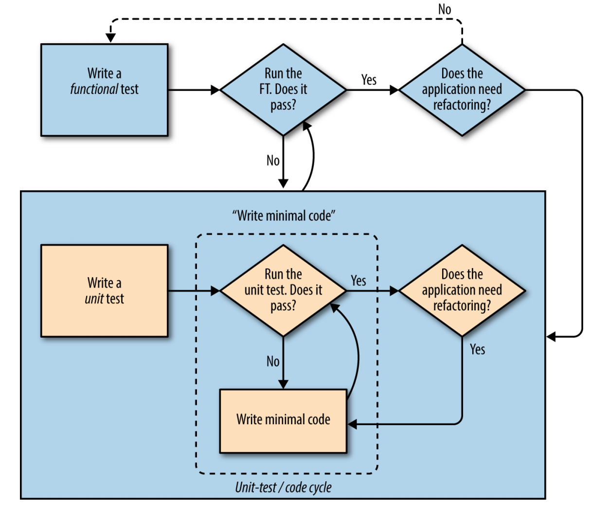

# 完整的 TDD 流程及测试代码重构

## 功能测试

```python
from selenium import webdriver
from selenium.webdriver.common.keys import Keys
import pytest


@pytest.fixture()
def browser():
    # 小明想用 chrome 浏览器访问网站
    browser = webdriver.Chrome('/Users/sziit/Programming/chromedriver')
    # 不过小明在每个页面最多等 10s, 如果还是没找到想要的东西, 就不找了
    browser.implicitly_wait(10)
    yield browser
    # 很好, 现在可以睡觉了
    browser.quit()

def test_homepage_title_should_have_今日清单(browser):
    # 他打开网站的主页
    browser.get('http://localhost:8000')

    # 他发现页面标题有 今日清单 字样
    assert '今日清单' in browser.title
    assert '今日清单' in browser.find_element_by_tag_name('h1').text

    # 他开始使用这个应用了

    # 他发现输入框显示: 想干点啥?
    inputbox = browser.find_element_by_id('new_item')
    assert '想干点啥?' in inputbox.get_attribute('placeholder')

    # 他在文本框输入: 今天什么都不想干
    inputbox.send_keys('今天什么都不想干')

    # 他点击 回车, 页面更新, 页面列表出现: 今天什么都不想干
    inputbox.send_keys(Keys.ENTER)
    table = browser.find_element_by_id('lists_table')
    rows = table.find_elements_by_tag_name('tr')
    assert any('今天什么都不想干' == row.text for row in rows) is True

    # 发现输入框已经空了, 他又在文本框输入: 今天要吃饭睡觉
    assert '想干点啥?' == inputbox.get_attribute('placeholder')
    inputbox.send_keys('今天要吃饭睡觉')

    # 他点击 回车, 页面更新, 页面列表新增: 今天要吃饭睡觉
    inputbox.send_keys(Keys.ENTER)
    assert any('今天什么都不想干' == row.text for row in rows) is True
    assert any('今天要吃饭睡觉' == row.text for row in rows) is True

    # 他关闭页面, 再次打开, 自己的清单项目都还在

```

提示找不到 h1
```bash
>       raise exception_class(message, screen, stacktrace)
E       selenium.common.exceptions.NoSuchElementException: Message: no such element: Unable to locate element: {"method":"css selector","selector":"h1"}
E         (Session info: chrome=84.0.4147.89)

../django_env/lib/python3.7/site-packages/selenium/webdriver/remote/errorhandler.py:242: NoSuchElementException
```

改:

## 写代码及单元测试

在 python 代码中写 html 不方便, 我们还是在 html 文件中写 html 好.

建立模板文件夹及其文件:

```bash
lists
├── __init__.py
├── admin.py
├── apps.py
├── migrations
│   └── __init__.py
├── models.py
├── templates
│   └── lists
│       └── home.html
├── tests
│   ├── __init__.py
│   └── view_test.py
├── urls.py
└── views.py
```

测试:

```py
def test_use_correct_template(self, response):
    assertTemplateUsed(response, 'lists/home.html')
```

在 home.html 中, 写:

```html
<html>
<title>今日清单</title>
</html>
```

views.py:

```python
from django.shortcuts import render


def home_page(request):
    return render(request, 'lists/home.html')
```

### 单元测试开始

```bash
>       raise TemplateDoesNotExist(template_name, chain=chain)
E       django.template.exceptions.TemplateDoesNotExist: lists/home.html

../django_env/lib/python3.7/site-packages/django/template/loader.py:19: TemplateDoesNotExist
```

为啥 Django 找不到呢? 我们得明确告诉 Django 才行. 在 "suputerlists/settings.py", 加入我们自己的 app:

```python
INSTALLED_APPS = [
    'django.contrib.admin',
    'django.contrib.auth',
    'django.contrib.contenttypes',
    'django.contrib.sessions',
    'django.contrib.messages',
    'django.contrib.staticfiles',

    'lists.apps.ListsConfig',  # 这里
]
```

这次单元测试都可以通过了.

### 重构测试

总是写 `response = client.get('/')` 显然不是一个很好的方法, 我们可以用 pytest 的 fixture

```python
from django.urls import resolve
from pytest_django.asserts import assertTemplateUsed
import pytest

from ..views import home_page


class TestHomePage:
    @pytest.fixture()
    def response(self, client):
        return client.get('/')


    def test_root_url_should_use_home_page_method(self):
        home = resolve('/')
        assert home.func == home_page, '应该用的是 home_page 方法'


    def test_get_root_url_should_return_200(self, client, response):
        assert response.status_code == 200, '应该可以返回 200'

    # 这种东西不要多测, 只检查最重要的
    def test_home_page_should_return_今日清单(self, client, response):
        assert '今日清单' in response.content.decode('utf8'), '网页应该显示 今日清单'

    def test_home_page_return_correct_html(self, client, response):
        assertTemplateUsed(response, 'lists/home.html')
        # assertTemplateUsed(response, 'wrong.html')
```

看看测试覆盖, 全都是 100% 了.

### HTML 模板
修改模板:
home.html:

```html
<html>
<head>
    <title>今日清单</title>
</head>
<body>
    <h1>今日清单</h1>
    <input type="text" id="new_item" placeholder='想干点啥?'>
    <table id="list_table"></table>
</body>
</html>
```

运行测试:

```bash
>       assert any('今天什么都不想干' == row.text for row in rows) is True
E       assert False is True
E        +  where False = any(<generator object test_homepage_title_should_have_今日清单.<locals>.<genexpr> at 0x7f9f43981390>)

functional_tests/functional03_test.py:37: AssertionError
```

## tdd 流程



下一步就得和服务器交互了.

## 读取与写入数据库
* 读取已有数据 -> 显示数据
* 用户输入 -> 回车 -> 上传服务器

### html
根据错误提示, 更新 home.html

```html
<html>
<head>
    <title>今日清单</title>
</head>
<body>
    <h1>今日清单</h1>
    <form method="POST">
        <input type="text" id="new_item" placeholder='想干点啥?'>
    </form>
    <table id="list_table"></table>
</body>
</html>
```
又出现了错误了:

```bash
Forbidden (403)
CSRF verification failed. Request aborted.

You are seeing this message because this site requires a CSRF cookie when submitting forms. This cookie is required for security reasons, to ensure that your browser is not being hijacked by third parties.

If you have configured your browser to disable cookies, please re-enable them, at least for this site, or for “same-origin” requests.

Help
Reason given for failure:

    CSRF cookie not set.
```

> 关于 CSRF 后面讨论

修改:
加入
```html
<form method="POST">
    
    <input type="text" id="new_item" placeholder='想干点啥?'>
</form>
```

看一下浏览器源代码是啥:

```html
<form method="POST">
    <input type="hidden" name="csrfmiddlewaretoken" value="armfR1ioALcvnfIS8Gs1YKc3Tn8hzFY6sSetDnr6pnm6005yCJImVpX4yeck85Ze">
    <input type="text" id="new_item" name="new_item" placeholder='想干点啥?'></form>
```
其实就是随机生成一串字符, 这样服务器就根据这串字符确定数据是不是来自合法的 post

再次测试:

```bash
>       assert any('今天什么都不想干' == row.text for row in rows) is True
E       assert False is True
E        +  where False = any(<generator object test_homepage_title_should_have_今日清单.<locals>.<genexpr> at 0x7fbd76b82390>)

functional_tests/functional03_test.py:37: AssertionError
```

终于跟我说找不到内容了, 因为我们没写后端代码啊

### 处理 post
因为我们在 form 中没有写 `action=去哪里`, 所以表单提交给了同样的 url, 还是用 home_page 方法处理.

现在有新的功能需求了, 开始写单元测试吧:

```python
def test_home_page_handle_POST_request(self, client):
    response = client.post('/', data={'new_text': 'a new item'})
    assert 'a new item' in response.content.decode('utf8')
    assertTemplateUsed(response, 'lists/home.html')
```

报错:
```bash
E       assert 'a new item' in '<html>\n<head>\n    <t
...
lists/tests/view_test.py:31: AssertionError
```
现在需要处理 POST 了, 在 home_page 方法中:

```python
from django.shortcuts import render
from django.http import HttpResponse


def home_page(request):
    if request.method == 'POST':
        return HttpResponse(request.POST['new_text'])

    return render(request, 'lists/home.html')
```


我们只说了要 POST, 但是并没有指定用那个模板来处理这个请求

### 在模板中显示变量

我们现在需要将 `home_page` POST 提交的信息在模板显示:

home_html:

```html
<table id="list_table">
    <tr>
        <td>{{ new_text }}</td>
    </tr>
</table>
```


报错
```bash
>       raise self.failureException(msg)
E       AssertionError: No templates used to render the response

../../../../miniconda3/lib/python3.7/unittest/case.py:680: AssertionError
```

代码解决:

```python
def home_page(request):
    return render(request, 'lists/home.html', {
        'new_text': request.POST['new_text']
    })
```


```bash
E           django.utils.datastructures.MultiValueDictKeyError: 'new_text'

../django_env/lib/python3.7/site-packages/django/utils/datastructures.py:78: MultiValueDictKeyError
```

很多情况是没有 post 请求的, 那么 `request.POST['new_text']` 就会出问题, 我们可以使用 python 的 `dict.get` 方法. 找不到不报错, 而是返回 None

```python
def home_page(request):
    return render(request, 'lists/home.html', {
        'new_text': request.POST.get('new_text', '')
    }
```

这次单元测试都通过了.

再看看功能测试还有啥需求

```bash
>       assert any('今天什么都不想干' == row.text for row in rows) is True
E       assert False is True
E        +  where False = any(<generator object test_homepage_title_should_have_今日清单.<locals>.<genexpr> at 0x7fead8fc2390>)

functional_tests/functional03_test.py:37: AssertionError
```

还没有显示出来内容!

## model

我们应该使用 model 来处理数据了

```python
import pytest

from ..models import Item


@pytest.mark.django_db
class TestItemModel:
    def test_item_model_should_save_and_retrive_items(self):
        first_item = Item()
        first_item.text = 'The first item'
        first_item.save()

        second_item = Item()
        second_item.text = 'The second item'
        second_item.save()

        saved_items = Item.objects.all()
        assert saved_items.count() == 2

        assert saved_items[0].text == 'The first item'
        assert saved_items[1].text == 'The second item'
```

> 涉及到了数据库, 并不是完全意义上的单元测试
> 要测试数据库, 必须有: `@pytest.mark.django_db`

运行测试:

```bash
lists/tests/model_test.py:3: in <module>
    from ..models import Item
E   ImportError: cannot import name 'Item' from 'lists.models' (/Users/sziit/Programming/python_web/django/superlists/lists/models.py)
```

没有 model, list/models.py

```python
from django.db import models


class Item():
    pass
```

运行测试:

```bash
>       first_item.save()
E       AttributeError: 'Item' object has no attribute 'save'

lists/tests/model_test.py:11: AttributeError
```

没有 save 方法, 我们得继承 django 的 model

```python
class Item(models.Model):
    text = models.TextField())
```

```bash
>       assert saved_items[0] == 'The first item'
E       AssertionError: assert <Item: Item object (1)> == 'The first item'

lists/tests/model_test.py:20: AssertionError
```

还是啥的没有

### 数据库迁移

为了让数据库知道自己要干啥, 需要进行数据库迁移

```bash
python manage.py makemigrations posts
python manage.py migrate posts 
```

单元测试都过了.

### 测试 post

```python
def test_item_model_should_save_post_request(self, client):
    response = client.post('/', data={'new_text': 'an item'})

    assert Item.objects.count() == 1

    new_item = Item.objects.first()
    assert new_item.text == 'an item'
    
    assertTemplateUsed(response, 'lists/home.html')
    assert 'an item' in response.content.decode()
```

出错:

```bash
>       assert Item.objects.count() == 1
E       assert 0 == 1
```

修改 views.py

```python
def home_page(request):
    if request.method == 'POST':
        item = Item()
        item.text = request.POST.get('new_text', '')
        item.save()

    return render(request, 'lists/home.html', {
        'new_text': request.POST.get('new_text', '')
    })
```

测试通过

不过现在有些其他问题:

* 我们会保存空字符串
* 实现 post 的方法有点奇怪


测试
```python
    def test_item_model_should_not_save_empty_items(self, client):
        client.get('/')
        assert Item.objects.count() == 0
```

重构 view.py

```python
def home_page(request):
    if request.method == 'POST':
        text = request.POST.get('new_text', '')
        Item.objects.create(text=text)
    else:
        text = ''

    return render(request, 'lists/home.html', {
        'new_text': text
    })
```

post 应该跳转:

```python
    def test_item_model_should_save_post_request(self, client):
        response = client.post('/', data={'new_text': 'an item'})

        assert Item.objects.count() == 1

        new_item = Item.objects.first()
        assert new_item.text == 'an item'

        assert response.status_code == 302
        assert response['location'] == '/'
```

再次测试, 失败:

```bash
>       assert response.status_code == 302
E       assert 200 == 302
```

修改 home_page.py:

```python
def home_page(request):
    if request.method == 'POST':
        text = request.POST.get('new_text', '')
        Item.objects.create(text=text)
        return redirect('/')

    return render(request, 'lists/home.html')
```

通过了.

### 重构测试

单元测试已经写乱了

重新整理一下:

```python
    def test_item_model_should_save_post_request(self, client):
        response = client.post('/', data={'new_text': 'an item'})

        assert Item.objects.count() == 1

        new_item = Item.objects.first()
        assert new_item.text == 'an item'

        assert response.status_code == 302
        assert response['location'] == '/'
```

这里面测试的东西太多了, 单元测试只测试一个点, 而且后面的测试应该是 view 中的内容

view_test.py:

```python
@pytest.mark.django_db
class TestHomePage:
    ...

    @pytest.fixture()
    def post_response(self, client):
        return client.post('/', data={'new_text': 'a new item'})

    ...

    # def test_home_page_handle_POST_request(self, post_response):
    #     assert 'a new item' in post_response.content.decode('utf8')
    #     assertTemplateUsed(post_response, 'lists/home.html')


    def test_home_page_POST_should_redirect(self, post_response):
        assert post_response.status_code == 302
        assert post_response['location'] == '/'
```

### 显示 item 列表

写测试, view_test.py:

```python
def test_home_page_should_show_all_items_in_db(self, client):
    Item.objects.create(text='item1')
    Item.objects.create(text='item2')

    get_response = client.get('/')

    assert 'item1' in get_response.content.decode()
    assert 'item2' in get_response.content.decode()
```

肯定过不了:

```
>       assert 'item1' in get_response.content.decode()
```

更改 views.py:

```python
def home_page(request):
    if request.method == 'POST':
        text = request.POST['new_item']
        Item.objects.create(text=text)
        return redirect('/')

    items = Item.objects.all()
    return render(request, 'lists/home.html', {'items': items})
```

html:
```html
<html>
<head>
    <title>今日清单</title>
</head>
<body>
    <h1>今日清单</h1>
    <form method="POST">
        
        <input type="text" id="new_item" placeholder='想干点啥呢'>
    </form>
    <table id="lists_table">
    
        <tr>
            <td>{{ forloop.counter}}: {{ item.text }}</td>
        </tr>
    
    </table>
</body>
</html>
```


```python
    ...
    assert any('今天什么都不想干' in row.text for row in rows) is True

    # 因为页面刷新, 需要再次找到 inputbox等
    inputbox = browser.find_element_by_id('new_item')
    # 发现输入框已经空了, 他又在文本框输入: 今天要吃饭睡觉
    assert '想干点啥?' in inputbox.get_attribute('placeholder')
    inputbox.send_keys('今天要吃饭睡觉')

    # 他点击 回车, 页面更新, 页面列表新增: 今天要吃饭睡觉
    # 因为页面刷新, 需要再次找到 inputbox等
    inputbox.send_keys(Keys.ENTER)
    table = browser.find_element_by_id('list_table')
    rows = table.find_elements_by_tag_name('tr')
 
    ...
```

这么麻烦的话, 重构吧:

```python
from selenium import webdriver
from selenium.webdriver.common.keys import Keys
import pytest


@pytest.fixture()
def browser():
    # 小明想用 chrome 浏览器访问网站
    browser = webdriver.Chrome('/Users/sziit/Programming/chromedriver')
    # 不过小明在每个页面最多等 10s, 如果还是没找到想要的东西, 就不找了
    browser.implicitly_wait(10)
    yield browser
    # 很好, 现在可以睡觉了
    browser.quit()

def test_homepage_title_should_have_今日清单(browser):
    def assert_inputbox_placeholder_is(text):
        inputbox = browser.find_element_by_id('new_item')
        assert text == inputbox.get_attribute('placeholder')

    def input_box_send_key(k):
        inputbox = browser.find_element_by_id('new_item')
        inputbox.send_keys(k)

    def assert_table_row_text_include(text):
        table = browser.find_element_by_id('list_table')
        rows = table.find_elements_by_tag_name('tr')
        assert any(text in row.text for row in rows) is True

    # 他打开网站的主页
    browser.get('http://localhost:8000')

    # 他发现页面标题有 今日清单 字样
    assert '今日清单' in browser.title
    assert '今日清单' in browser.find_element_by_tag_name('h1').text

    # 他开始使用这个应用了

    # 他发现输入框显示: 想干点啥?
    assert_inputbox_placeholder_is('想干点啥?')

    # 他在文本框输入: 今天什么都不想干
    input_box_send_key('今天什么都不想干')

    # 他点击 回车, 页面更新, 页面列表出现: 今天什么都不想干
    input_box_send_key(Keys.ENTER)

    assert_table_row_text_include('今天什么都不想干')

    assert_inputbox_placeholder_is('想干点啥?')
    input_box_send_key('今天要吃饭睡觉')

    # 他点击 回车, 页面更新, 页面列表新增: 今天要吃饭睡觉
    input_box_send_key(Keys.ENTER)

    assert_table_row_text_include('今天什么都不想干')
    assert_table_row_text_include('今天要吃饭睡觉')
 
    # 他关闭页面, 再次打开, 自己的清单项目都还在
```


