# 参数化测试与配对测试

上一部分测试了用户相关的基本功能, 但是有许多特殊点并没有测试, 比如各种非法输入, 而防止这些情况发生是测试的一项重要任务. 成功人士都一样的成功, 而不幸的人却各有各的不幸, 如果测试出所有的不幸呢? 不可能! 我们只能尽力覆盖, 又不要太累, 所以使用配对测试和参数化测试.

## 遇到的问题

对于一个用户, 我们希望:

* 用户名不要太长, <= 150
* 邮箱必须提供, 而且真的是邮箱才行
* 年龄可有可无, 但是填的不能是负数
* 密码要有适当的强度

这些我们都没有测试!

下面就写这些测试, 在写之前,怎么设置测试用例呢? 还是需要一些理论基础的.

### 测试点太多怎么办?

前面介绍过, 测试一个简单的功能, 都要大量的测试用例, 也就是测试点太多了, 有什么方法可以解决这个问题呢? 

其中最简单容易想到的, 可能就是找相似的测试用例, 在这些相似的用例中, 只测试一个. 这个思想就是`等价类分析法`.

## 等价类分析法


等价类分析法将程序所有可能的输入数据（有效的和无效的）划分成若干个部分（等价类）。然后从每个部分中选取具有代表性的数据当做测试用例进行合理的分类.

其背后的原因是各个输入数据对于揭露程序中的错误都是等效的. 使用等价类法可以减少冗余测试.

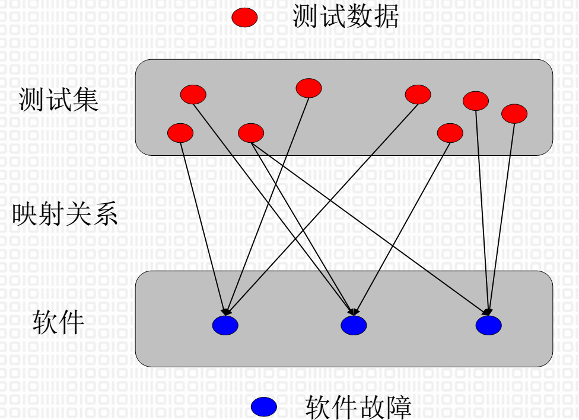

* 等价类可划分为两种不同的情况：有效等价类和无效等价类。
  * 有效等价类: 对于程序的规格说明来说是合理的、有意义的输入数据所构成的集合。利用有效等价类可检验程序是否实现了规格说明中所规定的功能和性能。
  * 无效等价类: 与有效等价类的定义恰巧相反。无效等价类是指对程序的规格说明来说不合理的或无意义的输入数据所构成的集合。无效等价类至少应有一个，也可能有多个。
* 设计测试用例时，要同时考虑这两种等价类。

> 英文: Equivalence Class testing, Domain testing 或者 Partition testing

### 划分方法
* 完备测试、避免冗余: 集合划分为互不相交的一组子集，而子集的并集是整个集合
* 不是到是, 由粗到细 (先问是不是, 再问为什么)

### 例子

#### 软件规格说明要求输入条件为小于100大于10的整数x

* 非数字, 非整数 (是不是)
* 有效等价类为 10＜x＜100
* 两个无效等价类为 x≤10 和 x≥100

#### 软件规格说明“学生允许选修5到8门课”

* 不是数字, 非整数
* 无效等价类可取“选课不足5门”和“选课超过8门”
* 则一个有效等价类可取“选课5到8门”

### 问题

不过等价类分析法有一个问题, 那就是在边界的点很可能和处于中心的点性质有区别. 最简单的, 我们在写判断的时候, 经常要想一下是应该用 `>` 还是 `>=`, 如果用错的话, 除了判断边界的数值, 其他数值是不会出问题的. 所以处于边界的点更容易出错, 我们就需要采用一些技术手段来覆盖这些点的测试, 这就需要`边界值分析法`.

## 边界值分析法

边界值分析法就是对输入或输出的边界值进行测试的一种测试方法。通常边界值分析法是作为对等价类划分法的补充，这种情况下，其测试用例来自等价类的边界。

### 常见的隐式边界值  
* 对16-bit的整数而言32 767和−32 768是边界；
* 屏幕上光标在最左上、最右下位置；
* 报表的第一行和最后一行；
* 数组元素的第一个和最后一个；
* 循环的第0次、第1次和倒数第2次、最后一次。

例如：如果程序的规格说明中规定：“重量在10 公斤至 50公斤范围内的邮件，其邮费计算公式为……”。作为测试用例，我们应取 10 及 50，还应取10.01,49.99,9.99及50.01等。

### 问题

不管是等价类方法还是边界值方法, 都是着重考虑输入条件，但没有考虑输入条件的各种组合、输入条件之间的相互制约关系。这样虽然各种输入条件可能出错的情况已经测试到了，但多个输入条件组合起来可能出错的情况却被忽视了。如果在测试时必须考虑输入条件的各种组合，则可能的组合数目将是天文数字，因此必须考虑采用一种适合于描述多种条件的组合、相应产生多个动作的形式来进行测试用例的设计，这就需要使用其他测试技术了.

## 因果图和判定表

这两种方法是十分专业的测试方法, 但是我认为并不适合于开发者, 因为这两种方法太专业, 太复杂. 试想你开发一套软件, 没有被开发难倒, 但是却被测试难倒是一种什么体验? 由于我们针对开发者介绍测试技术, 所以这两中方法就不介绍了.

## 配对测试 (Pairwise Testing)

为了既能够测试各种条件的组合, 又能够简单快速, 我们可以使用配对测试.

程序中最常见的错误通常由单个输入参数或参数对之间的交互产生。涉及三个或更多参数之间相互作用的错误逐渐变少, 并且发现的成本也越来越高. 

使用配对测试方法挑选测试用例是一种有效的**成本收益折衷方案**，可以显著减少测试用例的数量，而不会显着影响功能覆盖.

测试覆盖可以参见下图:
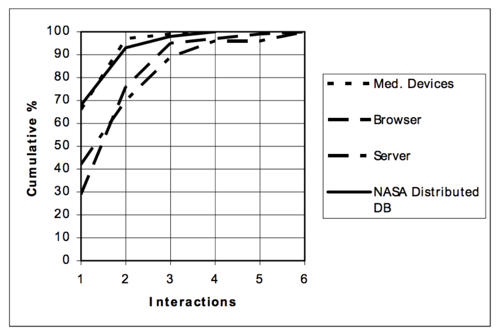

### 举例说明
假设我们测试名为“电话借阅系统”的应用程序，该应用程序具有以下输入参数及其允许值。

* 多伦多公共图书馆提供书籍阅读或者借出的服务，而有些书籍根据条形码不可以借出，但只能在馆内阅读。
* 多伦多公共图书馆仅供多伦多居民使用。其他城市居民只能阅读书籍但不能借出书籍。
* 可以通过网站在线预订图书，也可以在图书馆内部直接预订。
* 书籍有两种语言，法语和英语。
* 书籍包括百科全书，小说和学术类别。

#### 第一步, 确定变量和其取值范围

* 会员居住地：如果图书馆成员是安大略省其他城市的多伦多居民，如汉密尔顿，密西沙加和布兰普顿。共有4个城市。
* 图书条形码：图书馆共有80,000本图书，相关状态为保留和非保留。
* 书籍语言：书籍有法语或英语两种版本。共2种语言。
* 预订方法：如上所述，共有2种方式，如在线或内部。
* 书籍类别：如上所述，共有3类书籍。这三个类别是百科全书，小说和学术。

如果要测试所有可能组合的话, 其有效类总数有:

$$
total = 4 \times 80,000 \times 2 \times 2 \times 3 = 3,840,000
$$

如果再考虑无效类的话, 测试用例将会是天文数字.

#### 第二步, 简化问题

* 让我们将图书条形码变量减少为保留和非保留，即总共2个值。
* 让我们的会员住所可以作为多伦多和其他城市的非多伦多，即总共2个值。
* 此外，尝试使用组和边界条件，即使数据可能不是非离散的。

$$
total = 2 \times 2 \times 2 \times 2 \times 3 = 48
$$

#### 第三步, 将变量转变为测试输入数据


将列根据变量数目排序

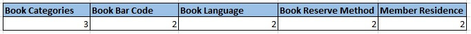

#### 第四步, 如下表设置

首先选择具有最大允许值数的列，然后如下图放置变量值。它实际上是前两列数的乘积（此处3 X 2 = 6）。

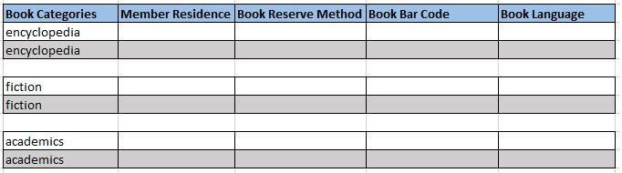

基于按降序排列的前两列，做出如下表所示的表。这样每个图书类别都应该提供给多伦多和非多伦多居民。

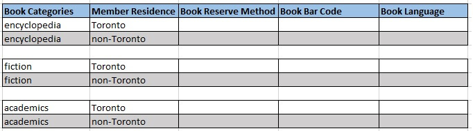

我们尝试放置下一列“Book reserve method”，以便它提供最大的测试覆盖率，在放置在线和内部值后，它将如下所示。

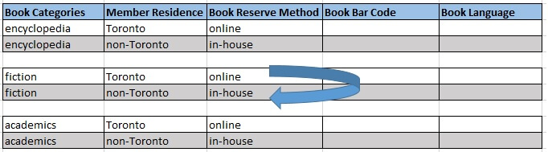

在放置online和in-house值后，我们可以观察到成对的 "Toronto, online" 和"non-Toronto, in-house"。使用这些数据，这两个城市分别无法进行online和in-house的测试。当我们交换online和in-house时，问题可以解决，如上图所示，它将如下图所示。

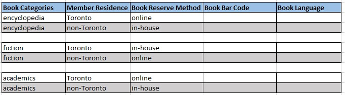

接着处理下一个变量'Book Bar Code'。我们再次发现成对的 "Toronto, reserve" 和 "non-Toronto, non-reserve"。为了增加测试覆盖率，我们可以交换此列第5行和第6行的值，如下所示。

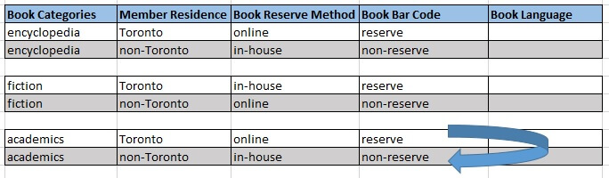

结果如下:

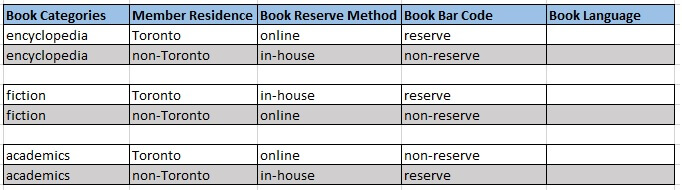


类似方法填充下一列, 保证每行的配对都是唯一的并且覆盖所有可能.

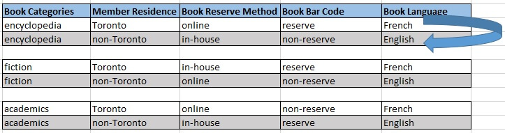


最后我们只需要六个测试用例即可.

#### 结论

“配对测试”需要初步理解和选择可能的输入数据组合。有效地选择的话，可以提高错误发现率。它是最好的设计之一，可以在相当少的工作量和时间内实现高测试效率。目前有许多工具可供选择

#### 工具
[Pairwise Testing Tool 1](https://sqamate.com/tools/pairwise)
[Pairwise Testing Tool 2](https://pairwise.teremokgames.com/)

结果不太一样, 但是基本一致

## 练习

测试计算器功能

### 测试用例

首先设计测试用例, 输入分为三个部分: 数字 1, 运算符, 数字 2. 

首先使用等价类和边界值方法获取数字的用例: -100, -43, 0, 33, 100. 

然后使用配对测试设计所有测试用例 (使用介绍过的工具):

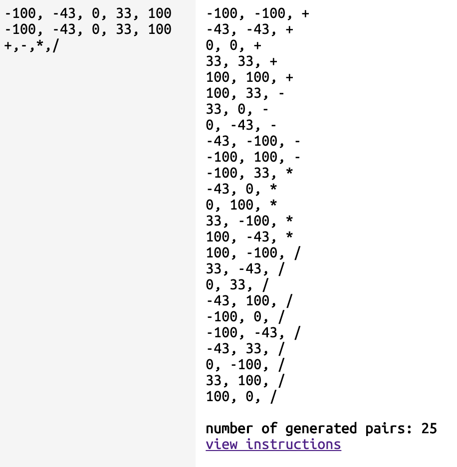


## 参考资料
* [Pairwise Testing wiki](https://en.wikipedia.org/wiki/All-pairs_testing)
* [pairwise.org/](http://www.pairwise.org/)
* [Pairwise Testing in Software Testing](http://www.softwaretestingclass.com/pairwise-testing-in-software-testing/)
* [Pairwise Testing Tool 1](https://sqamate.com/tools/pairwise)
* [Pairwise Testing Tool 2](https://pairwise.teremokgames.com/)
* [A Review of Pair-wise Testing](https://arxiv.org/pdf/1606.00288.pdf)
* [python piresise tesing 工具](https://github.com/thombashi/allpairspy)


## pytest 测试
理论够了, 怎么实现呢? 需要 pytest 的参数化测试. 不过我们用了这么长时间 pytest 了, 还是来真正熟悉一下这个测试软件吧

### 函数名
`pytest` 要求函数名必须有 "test", 否则不测试. 文件名也必须有 "test". 

> 但是我们之前写 `pytest-bdd` 代码的时候并没有这个要求. 原因是 `pytest-bdd` 自动帮我们加了 "test"

### 运行测试

运行测试我们都会了, 命令行直接输入 `pytest` 然后回车就可以. 但是如果想要拥有更多能力呢?

### 显示更多信息 `-v`

试一下, 会发现:

```bash
* pytest -v code/pytest/test_simple.py

collected 7 items                                                                                                           

code/pytest/test_simple.py::test_equal PASSED                                                                         [ 14%]
code/pytest/test_simple.py::test_not_equal PASSED                                                                     [ 28%]
code/pytest/test_simple.py::test_add PASSED                                                                           [ 42%]
code/pytest/test_simple.py::test_sub PASSED                                                                           [ 57%]
code/pytest/test_simple.py::test_a_little_slow PASSED                                                                 [ 71%]
code/pytest/test_simple.py::test_slow PASSED                                                                          [ 85%]
code/pytest/test_simple.py::test_very_slow PASSED 
```

这个选项给了我们很多信息

### 根据关键字运行 `-k`

这个选项根据测试函数名的关键字匹配, 这里如果运行

```bash
* pytest -k "equal" code/pytest/test_simple.py
```

那么就会匹配函数名有 "equal" 的函数去运行, 也就是 "test_equal" 和 "test_not_equal", 如果想要看到, 还可以组合上面两个命令:

```bash
* pytest -vk "equal" code/pytest/test_simple.py
collected 7 items / 5 deselected / 2 selected                                                                               

code/pytest/test_simple.py::test_equal PASSED                                                                         [ 50%]
code/pytest/test_simple.py::test_not_equal PASSED  
```

还可以进行关键字的布尔运算:

```bash
* pytest -vk "add or sub" code/pytest/test_simple.py
collected 7 items / 5 deselected / 2 selected                                                                               

code/pytest/test_simple.py::test_add PASSED                                                                           [ 50%]
code/pytest/test_simple.py::test_sub PASSED
```
这样就把关键字有 "add" 和 "sub" 的函数都执行了

### 根据标记执行 `-m`

如果若干测试有类似的功能, 我们可以给他们做一个标记, 这样之后就可以单独一起运行了.

```python
@pytest.mark.cal
def test_add():
    assert 1 + 1 == 2

@pytest.mark.cal
def test_sub():
    assert 1 - 1 == 0
```

这段代码做了 "cal" 标记, 要执行可以:

```bash
* pytest -m "cal" code/pytest/test_simple.py
```

### 是谁那么慢 `--durations=N`

这个命令可以告诉我们最慢的 N 个测试, 比如:

```bash
* pytest --durations=3 code/pytest/

================================================= slowest 3 test durations ==================================================
1.00s call     code/pytest/test_simple.py::test_very_slow
0.50s call     code/pytest/test_simple.py::test_slow
0.10s call     code/pytest/test_simple.py::test_a_little_slow
```

这个命令告诉我最慢的 3 个分别是谁

### `assert`

`assert` 是你的重要工具, 中文翻译就是 `断言`(或者翻译为`我确信`)), 用它来判断正确与否, 后面跟布尔值就可以. 比如我们见过的:

```python
assert 1 == 1
```

### 期望出异常

比如期望什么情况下会抛出异常, 可以:

```python
def test_add_exception():
    with pytest.raises(TypeError):
        add('a', 'b')
```
把 `with` 这里翻译成好理解的中文：

```python
with：我要设置一个故事场景
with 同一行后面的内容：这个故事场景肯定要发生的事件
with 那一行后面若干行的内容：故事

with pytest.raises(TypeError):
        add('a', 'b')

--〉翻译

我要设置一个故事，这个故事场景肯定要“抛出一个异常”，而且这个异常是“TypeError”：
    这个故事如下：add('a', 'b')

我确信在这个故事（add('a', 'b')）发生的时候，上面的异常就会抛出
```

如果想要判断异常信息, 可以:

```python
def test_add_exception_message():
    with pytest.raises(TypeError) as error_info:
        add('a', 'b')

    error_message = error_info.value.args[0]
    assert error_message == '请输入数字'
```

### 参数化测试

参数化测试可以极大地减轻我们的劳动, 这样写大量测试用例就变得很简单了.

观察下列代码:

```python
@pytest.mark.parametrize('num1, num2, result',
[
    (1, 1, 2),
    (1, 2, 3),
    (3, 2, 5)
])
def test_calculator_add_should_return_sum(num1, num2, result):
    calculator = Calculator(num1, num2)
    assert result == calculator.add()
```

注意到几点变化:
* 使用了 `@pytest.mark.parametrize`
    * 其中的第一行是参数名, 后面是对应参数取值
* `test_calculator_add_should_return_sum(num1, num2, result)` 输入了参数

输入结果可以看到三个测试通过:

```bash
* pytest -v code/pytest/test_parameters.py

code/pytest/test_parameters.py::test_calculator_add_should_return_sum[1-1-2] PASSED                                   [ 33%]
code/pytest/test_parameters.py::test_calculator_add_should_return_sum[1-2-3] PASSED                                   [ 66%]
code/pytest/test_parameters.py::test_calculator_add_should_return_sum[3-2-5] PASSED                                   [100%]
```

> 注意测试方法后面跟着参数列表

这种方法提供参数有一个小问题, 输入参数是什么我们有点不太明白, 需要进入测试代码才知道. 也就是输入参数的可读性不好. 为了提高输入参数可读性, 可以可以直接输入对象:

```python
@pytest.mark.parametrize('calculator, result',
[
    (Calculator(1, 1), 2),
    (Calculator(1, 2), 3),
    (Calculator(3, 2), 5),
])
def test_calculator_add_should_return_sum1(calculator, result):
    assert result == calculator.add()
```

不过这个时候运行可以发现参数是什么不明确, 也就是输出的可读性不好:

```bash
code/pytest/test_parameters.py::test_calculator_add_should_return_sum1[calculator0-2] PASSED                          [ 66%]
code/pytest/test_parameters.py::test_calculator_add_should_return_sum1[calculator1-3] PASSED                          [ 83%]
code/pytest/test_parameters.py::test_calculator_add_should_return_sum1[calculator2-5] PASSED                          [100%]
```

对比两中加参数的方法, 前者的输出可读性好, 后者的输入可读性好. 有没有办法结合二者的有点呢? 我们可以借助 `parametrize` 的 `ids` 参数.

```python
parameters = [
    (Calculator(1, 1), 2),
    (Calculator(1, 2), 3),
    (Calculator(3, 2), 5),
]

cal_ids = [f"{p[0].num1} + {p[0].num2} = {p[1]}" for p in parameters]

@pytest.mark.parametrize('calculator, result',parameters, ids=cal_ids)
def test_calculator_add_should_return_sum_id(calculator, result):
    assert result == calculator.add()
```

首先, 将输入变量列表存在一个变量表. 然后遍历这个变量表制作出 id 表, 随后使用变量表和 id 表即可.

其输出结果可读性大大提高:

```bash
code/pytest/test_parameters.py::test_calculator_add_should_return_sum_id[1 + 1 = 2] PASSED                            [ 77%]
code/pytest/test_parameters.py::test_calculator_add_should_return_sum_id[1 + 2 = 3] PASSED                            [ 88%]
code/pytest/test_parameters.py::test_calculator_add_should_return_sum_id[3 + 2 = 5] PASSED                            [100%]
```

## pytest fixtures

就是这个 `@pytest.fixture()`.

fixture 可以在测试之前或者之后运行, 一般我们用它来准备测试环境, 比如测试数据.

```python
@pytest.fixture()
def some_num():
    return 4

def test_some_num(some_num):
    assert some_num == 4
```

`@pytest.fixture()`告诉 `pytest` 它修饰的方法是一个 fixture. 其他测试方法使用这个 fixture 的话, 将这个被修饰的方法名作为参数传递过去, `pytest` 就会在运行测试方法之前运行这个 fixture.


### setup 和 teardown
测试环境的准备和清理, 前面有下列代码, 就是例子:

```python
@pytest.fixture
def browser(scope='session'):
    b = webdriver.Chrome('/Users/sziit/Programming/chromedriver')
    # b = webdriver.Firefox()
    b.implicitly_wait(10)
    yield b
    b.quit()
```

### scope

可以添加 scope 来规定 fixture 的作用范围

| Scope    | 说明       |
| -------- | --------- |
| session  | 在一次Run或Debug中执行的所有case共享一个session,第一个case开始执行的时候session开始，最后一个case执行结束的时候session结束，这些case可能分布在不同的class或module中。 |
| module   | 一个.py文件可以看作一个module，其表示的范围指该文件中第一个case到最后一个case之间的范围    |
| class    | 表示的范围即class的范围  |
| function(默认) | 表示的范围即function的范围   |

> 可以使用 `--setup-show` 来观察

## 文件配置

* `pytest.ini`: pytest的主配置文件，可以改变pytest的默认行为
* `conftest.py`:  测试用例的一些fixture配置
* `__init__.py`: 识别该文件夹为python的package包,告诉 `pytest` 到上层目录找根目录及其配置文件
* `tox.ini`: 与pytest.ini类似，用tox工具时候才有用
* `setup.cfg`: 也是ini格式文件，影响setup.py的行为

参考配置:

```ini
[pytest]
addopts = -rsxX -l --tb=short --strict
; --rsxX 表示pytest报告所有测试用例被跳过、预计失败、预计失败但实际被通过的原因
xfail_strict = true
; 注册 markers
markers = 
    smoke: smoke test
    get: get test
```

> `pytest --markers` 查看有哪些注册的 marker


## 参考资料

* [pytest fixture scope](https://blog.csdn.net/u010924834/article/details/77840302)
* [ini配置文件](https://www.cnblogs.com/yoyoketang/p/9550648.html)