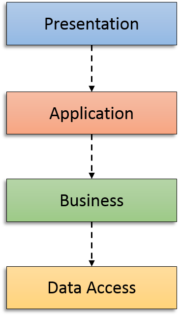

# 甩锅法编程

自外向内的 TDD, 其实就是我们一直做的, 先写功能测试, 然后单元测试. 我们先从外部设计系统, 然后再实现内部代码. 现在我们更有意识的进行这个过程.

## 自内向外
我们初学编程的时候, 或者大多数时候都是这样做的. 遇到一个项目, 首先想的是从最内层最底层开始.

比如现在这个任务, 假设用户有一个"我的清单列表"页面, 这个时候我们肯定想给 List 模型添加一个 owner 属性, 因为这个是太明显需要的一个属性了. 然后我们就会以这个模型为圆心, 一圈一圈地写代码, 先写控制器 (Django 里面的 View), 然后是模板, 最后是路由. 这样做的话我们心里感觉很踏实, 我们写的每一句代码都是建立在另外已经实现的代码之上的.

这样做有啥问题吗? 因为你咋知道外部怎么用的? 虽然不能说是拍脑袋想的, 但是的确是"我认为"外部会这么用. 这样的话, 很可能内部的代码实现太多功能了, 或者功能不够用, 或者你提供给外部的 API 根本就不方便使用. 

## 自外向内

自外向内就不会有这些问题. 我们首先使用了 API, 然后才实现其内部, 不多也不少, 而且肯定是外部好用的那种. 至于这个 API 怎么实现, 甩锅给下一个人去做. 每一层的你都甩锅给下一层你, 慢慢的就把所有代码写完了.

这个其实实现了依赖反转的要求.

### 依赖翻转:

在面向对象编程领域中，**依赖反转原则**（Dependency inversion principle，DIP）是指一种特定的解耦（传统的依赖关系创建在高层次上，而具体的策略设置则应用在低层次的模块上）形式，使得高层次的模块不依赖于低层次的模块的实现细节，依赖关系被颠倒（反转），从而使得低层次模块依赖于高层次模块的需求抽象。

该原则规定：

* 高层次的模块不应该依赖于低层次的模块，两者都应该依赖于抽象接口。
* 抽象接口不应该依赖于具体实现。而具体实现则应该依赖于抽象接口。

该原则颠倒了一部分人对于面向对象设计的认识方式。如高层次和低层次对象都应该依赖于相同的抽象接口。

使用依赖翻转:

* Controller 不再受限于必须使用某个 model, 可以使用任何可以给它提供数据的类
* 在不需要任何改变的情况下, 就可以使用其他数据提供类
* 比如新的 model 可能通过网络连接获取数据 

> 爸爸要啥, 儿子就给啥

以前可能这样:



现在是这样了:


## 功能测试开始一次流程

我们现在要添加一个显示我的所有计划的页面, 而且在导航栏放置这个页面的链接:

```python
import pytest

from .utils.helpers import (UserMixin, input_box_input_and_enter, 
                                    assert_table_row_text_include, 
                                    assert_inputbox_is_centered)


class TestMyList(UserMixin):
    @pytest.fixture(autouse=True)
    def browser(self, browser):
        self.browser = browser
        return browser

    def test_logged_in_users_lists_are_saved_as_my_lists(self, browser, live_server, user, password):
        self.live_server = live_server

        # 登录用户
        self.login(user, password)

        # 输入两个任务
        item1 = 'my first'
        item2 = 'my secode'
        input_box_input_and_enter(item1, browser)
        input_box_input_and_enter(item2, browser)
        # 记录下当前的网址
        first_list_url = browser.current_url

        # 发现有一个我的列表的链接, 并点击
        browser.find_element_by_id('my_list').click()

        # 发现之前添加的任务列表在那里, 而且根据第一个项目命名
        first_list = self.browser.find_element_by_link_text(item1)

        # 进入了我的所有列表页面
        assert browser.current_url == live_server.url + '/lists/'

        # 点击这和个任务链接
        first_list.click()

        # 可以发现又回到了这个任务的项目页面
        # assert browser.current_url == first_list_url

        # 新建另一个列表
        browser.get(live_server.url)
        item3 = 'my third'
        input_box_input_and_enter(item3, browser)
        second_list_url = browser.current_url

        # 再次到我的列表链接
        browser.find_element_by_id('my_list').click()
        third_link = browser.find_element_by_link_text(item3)

        # 进入这个列表, url 就是原来那个
        third_link.click()
        assert browser.current_url == second_list_url

        # 退出, 看不到我的计划了
        browser.find_element_by_id('logout').click()
        texts = browser.page_source
        assert '主页' in texts
        assert '注册' in texts
        assert '登录' in texts
        assert '退出' not in texts
        assert '我的计划' not in texts
```

运行这个测试, 报错:

```bash
TestMyList.test_logged_in_users_lists_are_saved_as_my_lists _____
functional_tests/my_lists_test.py:29: in test_logged_in_users_lists_are_saved_as_my_lists
    browser.find_element_by_id('my_list').click()
...
E   selenium.common.exceptions.NoSuchElementException: Message: no such element: Unable to locate element: {"method":"css selector","selector":"[id="my_list"]"}
```

### 最外层 -- 模板
测试说找不到这和个元素, 那我就在模板加上这个元素

lists/base.html
```html
...
<body>
<nav class="navbar navbar-expand-sm navbar-light bg-light">
  <button class="navbar-toggler" type="button" data-toggle="collapse" data-target="#navbarNav" aria-controls="navbarNav" aria-expanded="false" aria-label="Toggle navigation">
    <span class="navbar-toggler-icon"></span>
  </button>
  <a class="navbar-brand" href="">今日清单</a>

  <div class="">
      
        {{ user.username}}, 你好!
        <a class="nav-item" href="" id="logout">退出</a>
      
        <a class="nav-item" href="" id="signup">注册</a>
        <a class="nav-item" href="" id="login">登录</a>
       
  </div>

  <div class="collapse navbar-collapse" id="navbarNav">
    <ul class="navbar-nav">
      <li class="nav-item active">
        <a class="nav-link" href="">主页</a>
      </li>
      
      <li class="nav-item">
        <a class="nav-link" href="#" id="my_list">我的计划</a>
      </li>
      
    </ul>
  </div>
</nav>
...
```

我们添加的这个链接那也去不了, 所以我们看到的报错:

```bash
TestMyList.test_logged_in_users_lists_are_saved_as_my_lists _____
functional_tests/my_lists_test.py:32: in test_logged_in_users_lists_are_saved_as_my_lists
    assert browser.current_url == live_server.url + '/lists/'
E   AssertionError: assert 'http://local...ists/1/items/' == 'http://local...:53306/lists/'
E     - http://localhost:53306/lists/
E     + http://localhost:53306/lists/1/items/
E     ?                              ++++++++
```

那我们就让他去那里:

```html

<li class="nav-item">
<a class="nav-link" href="" id="my_list">我的计划</a>
</li>

```

又报错:

```python
E   selenium.common.exceptions.NoSuchElementException: Message: no such element: Unable to locate element: {"method":"link text","selector":"my first"}
```

模板有问题, 原因是我们根本没有这个模板, 所以我们需要加这个模板, 要开始写代码了.

### 向下一层到 View (控制器)
既然要写代码, 按照 TDD 要求, 先写单元测试, 要求我们使用正确的模板:

lists/view_test.py

```python
def test_my_lists_url_should_render_my_list_template(self, client):
    response = client.get(reverse('lists:my_lists', kwargs={'user': 'a@a.com'}))
    assertTemplateUsed(response, 'lists/my_lists.html')
```

报错:
```bash
E   django.urls.exceptions.NoReverseMatch: Reverse for 'my_lists' not found. 'my_lists' is not a valid view function or pattern name.
```

这告诉我们需要修改 urls.py

```python
from .views import home_page, lists, items, my_lists

app_name = 'lists'
urlpatterns = [
    path('', home_page, name='home'),
    path('lists/<int:id>/items/', items, name='items'), # post for create new item
    path('lists/', lists, name='lists'),  # get for all list, post for create new list
    path('lists/<user>/', my_lists, name='my_lists'), 
]
```

对应的 views.py
```python
def my_lists(request, user):
    return render(request, 'lists/my_lists.html')
```

对应的模板:

```html


我的计划
```

单元测试通过. 不过这个时候功能测试还是同样报错

## 再次自外向内

### 设计 API

修改 base.html

```html
<div class="container">

    
    

    <div class="row">
        <div class="col-md-6 offset-md-3">
            
            
        </div>
    </div>

    <div class="row">
        <div class="col-md-6 offset-md-3">
            
            
        </div>
    </div>
```

my_lists.html
```html


我的计划


<h1 class="text-center">我的计划</h1>



<h2>{{ user.username }}的计划</h2>   <!-- 🐶 -->
<ul>
      <!--  🐈-->
        <li><a href="{{ list.get_absolute_url }}">{{ list.name }}</a></li>  <!-- 🍓-->
    
</ul>

```
* 🐶 我们想要一个叫做 `user` 的变量用来代表模板中的用户
* 🐈 我们想要遍历某个用户的所有计划列表
* 🍓 我们希望使用 `list.name` 来显示

现在运行功能测试, 还是同样报错

### 再下一层 -- 到底要显示啥
我们需要告诉模板显示的具体内容, 最重要的是用户是谁

```python
def test_my_list_should_pass_correct_user_to_template(self, client):
    correct_user = Account.objects.create(username='john', email='a@a.com', password='Storng1234')
    wrong_user = Account.objects.create(username='wrong', email='wribg@a.com', password='Storng1234')

    response = client.get(reverse('lists:my_lists', kwargs={'user': correct_user.username}))
    assert response.context['user'] == correct_use
```

报错:
```bash
TestListView.test_my_list_should_pass_correct_user_to_template ______
lists/tests/view_test.py:195: in test_my_list_should_pass_correct_user_to_template
    assert response.context['user'] == correct_user
E   assert <SimpleLazyObject: <django.contrib.auth.models.AnonymousUser object at 0x7f9f32a29898>> == <Account: john>
```

所以修改 views.py

```python
def my_lists(request, user):
    user = Account.objects.get(username=user)
    return render(request, 'lists/my_lists.html', {'user': user})
```

这个测试过了, 上个测试挂了, 改一下上个测试: 

```python
def test_my_lists_url_should_render_my_list_template(self, client):
    correct_user = Account.objects.create_user(username='john', email='a@a.com', password='Storng1234')
    response = client.get(reverse('lists:my_lists', kwargs={'user': 'john'}))
    assertTemplateUsed(response, 'lists/my_lists.html')
```

运行功能测试, 报错:

```bash
TestMyList.test_logged_in_users_lists_are_saved_as_my_lists _______
functional_tests/my_lists_test.py:32: in test_logged_in_users_lists_are_saved_as_my_lists
    first_list = self.browser.find_element_by_link_text(item1)
    ...
E   selenium.common.exceptions.NoSuchElementException: Message: no such element: Unable to locate element: {"method":"link text","selector":"my first"}
```

找不到需要的内容, 肯定没有, 因为我们没写啊.

views 中已经把应该传的参数都传了, 现在需要 user 中有我们需要的 list 信息:

```python
def test_list_user_is_save_if_user_is_authenticated(self, client):
    user = Account.objects.create_user(username='john', email='a@a.com', password='Storng1234')
    client.force_login(user)
    client.post(reverse('lists:lists'), data={'text': 'new item'})
    list_ = List.objects.first()
    assert list_.user == user
```
这里的 `force_longin` 就是让测试客户端登录用户.

报错:
```bash
TestListView.test_list_user_is_save_if_user_is_authenticated _______________
lists/tests/view_test.py:203: in test_list_user_is_save_if_user_is_authenticated
    assert list_.user == user
E   AttributeError: 'List' object has no attribute 'user'
```
这个错误说明需要修改 view 为:

```python
def lists(request):
    if request.method == 'POST':
        form = ItemForm(data=request.POST)
        if form.is_valid():
            list_ = List()
            list_.user = request.user
            list_.save()
            # list_ = List.objects.create()
            # item = Item.objects.create(text=request.POST['text'], list=list_)
            form.save(for_list=list_)
            return redirect(list_)

        return render(request, 'lists/home.html', {'form': form})
```

不过这个不可能通过, 因为这个显然需要 model 实现了. 我们需要 model 记录当前列表是哪个用户创建的:

```bash
TestListView.test_list_user_is_save_if_user_is_authenticated _______________
lists/tests/view_test.py:203: in test_list_user_is_save_if_user_is_authenticated
    assert list_.user == user
E   AttributeError: 'List' object has no attribute 'user'
```

所以还得下一层

### 想一想

现在有一个失败测试, 在下一层意味着一个问题没解决又去解决另一个问题. 当然也可以使用 mock. 但是使用 mock 也有问题, 详见上一章. 所以我还是倾向于能把握得住的话就大胆的下一层.

### 再下一层 -- 模型

我们想要 `list` 有 `user`, 当然还要有 `user.list_set.all`

模型测试:

```python
def test_lists_should_have_user(self):
    user = Account.objects.create_user(username='john', email='a@a.com', password='Storng1234')
    list_ = List.objects.create(user=user)
    assert list_ in user.list_set.all()
```
报错:
```bash
E   TypeError: List() got an unexpected keyword argument 'user'
```

实现 (可以没有 user):

```python
from django.contrib.auth import get_user_model

class List(models.Model):
    user = models.ForeignKey(get_user_model(), on_delete=models.CASCADE, blank=True, null=True)

    def get_absolute_url(self):
        return reverse("lists:items", kwargs={"id": self.id})
```

测试:

```bash
TestItemAndListModel.test_item_model_should_save_post_request_from_list_page _
lists/tests/model_test.py:55: in test_item_model_should_save_post_request_from_list_page
    response = client.post('/lists/', data={'text': 'an item'})
    ...
E   ValueError: Cannot assign "<SimpleLazyObject: <django.contrib.auth.models.AnonymousUser object at 0x7f94e5fc8ba8>>": "List.user" must be a "Account" instance.
```

这里说我们将 `AnonymousUser` 赋值给了 `user`, 这个需要改 view 了:

```python
def lists(request):
    if request.method == 'POST':
        form = ItemForm(data=request.POST)
        if form.is_valid():
            list_ = List()
            ###############################
            if request.user.is_authenticated:
                list_.user = request.user
            ################################
            list_.save()
            form.save(for_list=list_)
            return redirect(list_)

        return render(request, 'lists/home.html', {'form': form}
```

现在所有测试通过.

不过功能测试说的是我们看不到 list 列表, 所以继续改.

model_test.py

```python
def test_list_name_should_be_the_first_item_text(self):
    list_ = List.objects.create()
    Item.objects.create(list=list_, text='first item')
    Item.objects.create(list=list_, text='second item')

    assert list_.name == 'first item'
```

models.py:

```python
class List(models.Model):
    user = models.ForeignKey(get_user_model(), on_delete=models.CASCADE, blank=True, null=True)

    def get_absolute_url(self):
        return reverse("lists:items", kwargs={"id": self.id})

    @property
    def name(self):
        return self.item_set.first().text
```

全过了

## 重构

```python
def lists(request):
    if request.method == 'POST':
        form = ItemForm(data=request.POST)
        if form.is_valid():
            list_ = List()
            if request.user.is_authenticated:
                list_.user = request.user
            list_.save()
            # list_ = List.objects.create()
            # item = Item.objects.create(text=request.POST['text'], list=list_)
            form.save(for_list=list_)
            return redirect(list_)

        return render(request, 'lists/home.html', {'form': form})
```

这里的工作太多了. View 需要创建 list, 需要验证用户, Form 来做不好吗? 

> 控制器有多层 if 往往是有问题的

如果能这样是不是更好:

```python
def lists(request):
    if request.method == 'POST':
        form = NewListForm(data=request.POST)
        if form.is_valid():
            list_ = form.save(user=request.user)
            return redirect(list_)

        return render(request, 'lists/home.html', {'form': form})
```
我们有了一个美好的愿望, 现在问题就是如何实现了.

### 以合作者的角度思考问题

`view` 会调用各种资源, 不过 `view` 不应该亲自去干, 它应该找合适的合作者去做. 这里, `view` 的主要合作者是 `form`, 但是现在 `form` 还没有怎么办? 这里我们试试 mock.

不过如果修改 `view` 中的 `lists` 方法, 会导致其他测试失败, 这里暂时在另一个方法 `list2` 中实现:

```python
class TestCreateItem:
    @pytest.fixture()
    def post_request(self):
        request = HttpRequest()
        request.POST['text'] = 'New Item'
        request.method = 'POST'
        request.user = mocker.Mock()
        return request
        ...
    def test_post_data_should_call_NewListForm(self, post_request, mocker):
        fake_form = mocker.patch('lists.views.NewListForm')
        lists2(post_request)
        fake_form.assert_called_once_with(data=post_request.POST)
```

因为根本没有这个 form, 所以报错:

报错:
```bash
E   AttributeError: <module 'lists.views' from '/Users/sziit/Programming/python_web/django/superlists/lists/views.py'> does not have the attribute 'NewListForm'
```

views.py:

```py
from .forms import ItemForm, UniqueItemForm, NewListForm
```

forms.py:
```py
class NewListForm(ItemForm):
    pass
```

再次测试, 报错:

```python
E   AssertionError: Expected 'NewListForm' to be called once. Called 0 times.
```

不错, 因为我们真的没用过.

`View` 中实现:

```python
def lists2(request):
    if request.method == 'POST':
        form = NewListForm(data=request.POST)
```

测试通过. 我们继续, 如果表单可以了, 下一步我们想保存表单

```py
def test_form_save_with_valid_user_should_be_called(self, post_request, mocker):
    fake_form = mocker.patch('lists.views.NewListForm').return_value  # return value 才能 mock 它的方法
    fake_form.is_valid.return_value = True

    lists2(post_request)
    fake_form.save.assert_called_once_with(user=post_request.user)
```

对应的 View:

```py
def lists2(request):
    if request.method == 'POST':
        form = NewListForm(data=request.POST)
        form.save(user=request.user)
```

接着, 我们还想如果表单合法, view 应该重定向到列表, 所以继续 mock 另一个合作者 redirect.

```py
def test_l1ist_page_POST_should_redirect(self, mocker, post_request):
    fake_form = mocker.patch('lists.views.NewListForm').return_value  # return value 才能 mock 它的方法
    fake_form.is_valid.return_value = True

    fake_redirect = mocker.patch('lists.views.redirect')

    response = lists2(post_request)

    assert response == fake_redirect.return_value
    fake_redirect.assert_called_once_with(fake_form.save.return_value)
```

```bash
assert response == fake_redirect.return_value
E   AssertionError: assert None == <MagicMock name='redirect()' id='140576152497624'>
```

没有返回值, 改 view:

```py
def lists2(request):
    if request.method == 'POST':
        form = NewListForm(data=request.POST)
        list_ = form.save(user=request.user)
        return redirect(list_)
```

改完之后, 刚才其他两个测试失败了, 因为我们用了系统的 `redirect`, 都 mock 掉.

```py
def test_post_data_should_call_NewListForm(self, post_request, mocker):
    fake_form = mocker.patch('lists.views.NewListForm')
    mocker.patch('lists.views.redirect')

    lists2(post_request)

    fake_form.assert_called_once_with(data=post_request.POST)

def test_form_save_with_valid_user_should_be_called(self, post_request, mocker):
    fake_form = mocker.patch('lists.views.NewListForm').return_value  # return value 才能 mock 它的方法
    fake_form.is_valid.return_value = True

    mocker.patch('lists.views.redirect')

    lists2(post_request)
    fake_form.save.assert_called_once_with(user=post_request.user)
```

### 表单不合法的情况

如果表单不合法, 我们渲染主页:

测试

```py
def test_invalid_form_should_render_home(self, mocker, post_request):
    fake_form = mocker.patch('lists.views.NewListForm').return_value  # return value 才能 mock 它的方法
    fake_form.is_valid.return_value = False
    
    fake_render = mocker.patch('lists.views.render')

    response = lists2(post_request)

    assert response == fake_render.return_value
    fake_render.assert_called_once_with(post_request, 'lists/home.html', {'form': fake_form})
```

代码:

```python
def lists2(request):
    if request.method == 'POST':
        form = NewListForm(data=request.POST)
        list_ = form.save(user=request.user)
        if form.is_valid():
            return redirect(list_)

        return render(request, 'lists/home.html', {'form': form})
```

不过如果不合法, 表单不应该保存吧, 测试:
```python
def test_invalid_form_should_not_save(self, mocker, post_request):
    fake_form = mocker.patch('lists.views.NewListForm').return_value  # return value 才能 mock 它的方法
    fake_form.is_valid.return_value = False
    
    lists2(post_request)

    assert fake_form.save.called == False
```
发现代码有问题, 改代码:

```python
def lists2(request):
    if request.method == 'POST':
        form = NewListForm(data=request.POST)
        if form.is_valid():
            list_ = form.save(user=request.user)
            return redirect(list_)
            ...
```

现在 view 搞定了, 继续 form 层

### form 层

我们已经大量 "使用了" NewListForm, 但是实际上没有写啥代码, 不过我们希望它的 save 方法能:
* 创建新的 list, 并给其设定 user
* 创建新的 item, 并给其设定 list
* 保存 item

不过 form 代码的任务太多了, 我们想用一句话解决上述任务怎么办? 甩锅给 model!

我们想 save 大概这么样:
```py
def save(self):
    List.create_new(first_item_text = some_text, user=user)
```

测试:
```py
@pytest.mark.django_db
class TestNewListFormTest:
    def test_anomynouse_user_save_method_should_create_new_list(self, mocker):
        user = mocker.Mock(is_authenticated=False)
        list_count = List.objects.count()
        form = NewListForm(data={'text': 'new item'})
        form.is_valid()  # 这样才可以使用 cleaned_data
        form.save(user=user)

        assert List.objects.count() == list_count + 1

    def test_authenticated_user_save_method_should_create_new_list(self, mocker):
        user = Account.objects.create_user(username='john', email='a@a.com', password='Storng1234')
        list_count = List.objects.count()
        form = NewListForm(data={'text': 'new item'})
        form.is_valid()
        form.save(user=user)

        assert List.objects.count() == list_count + 1
```


forms.py:

```python
class NewListForm(ItemForm):

    def save(self, user):
        if user.is_authenticated:
            return List.create_new(first_item_text=self.cleaned_data['text'], user=user)
        else:
            return List.create_new(first_item_text=self.cleaned_data['text'])
```

model:

```py
class List(models.Model):
    user = models.ForeignKey(get_user_model(), on_delete=models.CASCADE, blank=True, null=True)

    def get_absolute_url(self):
        return reverse("lists:items", kwargs={"id": self.id})

    @staticmethod
    def create_new(first_item_text, user=None):
        list_ = List.objects.create(user=user)
        Item.objects.create(text=first_item_text, list=list_)
        return list_

    @property
    def name(self):
        return self.item_set.first().text
```

这时, 所有测试通过.

为了用新的代码, 我们改变路由设置:

```py
urlpatterns = [
    path('', home_page, name='home'),
    path('lists/<int:id>/items/', items, name='items'), # post for create new item
    path('lists/', lists2, name='lists'),  # get for all list, post for create new list
    path('lists/<user>/', my_lists, name='my_lists'), 
]
```


参考:
* [Outside-In or Inside-Out? London or Chicago School? — Part 1: Greenfield Projects](https://itnext.io/outside-in-or-inside-out-london-or-chicago-school-part-1-greenfield-projects-d324390a0dbd)
* [Outside-In or Inside-Out? — Part 2: Refactoring Existing Projects](https://itnext.io/outside-in-or-inside-out-part-2-refactoring-existing-projects-dcf7f2ef4d2a)
* [TDD - Outside In vs Inside Out](https://softwareengineering.stackexchange.com/questions/166409/tdd-outside-in-vs-inside-out)